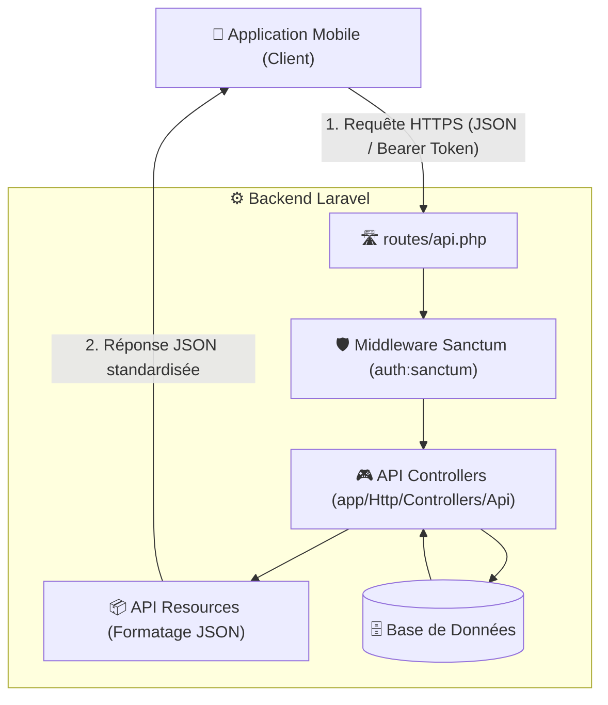

# 📱 Plan d'Implémentation de l'API REST Mobile

*Date de création : 23 Septembre 2026*  
*Projet : Plateforme de Gestion des Demandeurs d'Emploi (PGDE)*  
*Objectif : Fournir un jeu d'APIs RESTful sécurisées, performantes et normalisées pour la future application mobile (Flutter / React Native).*

---

## 🏗️ 1. Architecture & Principes Directeurs



### 🔒 Principes de Sécurité & Communication
1. **Authentification par Token (Laravel Sanctum) :** Aucun cookie/session web n'est requis. L'application mobile conserve un `Bearer Token` chiffré.
2. **Format universel JSON :** Toutes les requêtes et réponses transitent au format `application/json` (sauf les uploads en `multipart/form-data`).
3. **Séparation nette du code :** Tous les contrôleurs API sont isolés dans `app/Http/Controllers/Api/` pour ne pas impacter les vues web existantes.
4. **Structure de réponse unifiée :**
```json
{
  "success": true,
  "message": "Action exécutée avec succès.",
  "data": { ... }
}
```
En cas d'erreur (`422`, `401`, `404`, `500`) :
```json
{
  "success": false,
  "message": "Erreur de validation des données.",
  "errors": {
    "telephone1": ["Le numéro de téléphone est obligatoire."]
  }
}
```

---

## 📋 2. Tableau de Suivi des Phases

| Phase | Module / Thème | Objectifs & Livrables | Statut |
| :--- | :--- | :--- | :--- |
| **Phase 1** | **Socle & Authentification** | Configuration de Laravel Sanctum, routes d'inscription, connexion, déconnexion et mot de passe oublié. | ✅ Terminé |
| **Phase 2** | **Données de Référence** | Endpoints publics pour alimenter les listes déroulantes (Régions, Départements, Niveaux académiques, Emplois, Handicaps). | ✅ Terminé |
| **Phase 3** | **Gestion du Profil Candidat** | Récupération du profil complet (`summary`/`resume`) et mise à jour étape par étape (Identité, Formations, Expériences, Emplois ciblés). | ✅ Terminé |
| **Phase 4** | **Gestion des Documents** | Téléversement et suppression de la photo de profil, des justificatifs de diplômes et des fichiers CV. | ✅ Terminé |
| **Phase 5** | **Documentation & Recette** | Tests des endpoints (Postman / Collection JSON) et validation des formats de réponse. | ⏳ À faire |

---

## 🛣️ 3. Spécification Détaillée des Endpoints

### 🔐 Phase 1 : Authentification & Sécurité (`/api/auth`)

| Méthode | Endpoint | Description | Auth requise |
| :--- | :--- | :--- | :--- |
| `POST` | `/api/auth/register` | Inscription d'un nouveau candidat (création compte + profil initial). | ❌ Non |
| `POST` | `/api/auth/login` | Connexion candidat (génération du `Bearer Token`). | ❌ Non |
| `POST` | `/api/auth/forgot-password` | Demande de réinitialisation de mot de passe par e-mail. | ❌ Non |
| `GET` | `/api/auth/me` | Informations de l'utilisateur connecté et statut de son dossier. | ✅ Oui |
| `POST` | `/api/auth/logout` | Révocation du token et déconnexion. | ✅ Oui |

---

### 🌍 Phase 2 : Données de Référence (`/api/reference`)

| Méthode | Endpoint | Description | Auth requise |
| :--- | :--- | :--- | :--- |
| `GET` | `/api/reference/regions` | Liste de toutes les régions du Sénégal. | ❌ Non |
| `GET` | `/api/reference/regions/{id}/departements` | Liste des départements d'une région spécifique. | ❌ Non |
| `GET` | `/api/reference/niveaux-formation` | Niveaux académiques (Sans diplôme, BFEM, Bac, Licence, Master, etc.). | ❌ Non |
| `GET` | `/api/reference/secteurs` | Liste des secteurs d'activité. | ❌ Non |
| `GET` | `/api/reference/secteurs/{id}/emplois` | Liste des métiers / emplois rattachés à un secteur. | ❌ Non |
| `GET` | `/api/reference/emplois` | Liste complète de tous les métiers disponibles. | ❌ Non |
| `GET` | `/api/reference/handicaps` | Liste des types de handicaps recensés. | ❌ Non |

---

### 👤 Phase 3 : Profil & Parcours Candidat (`/api/candidat`)

| Méthode | Endpoint | Description | Auth requise |
| :--- | :--- | :--- | :--- |
| `GET` | `/api/candidat/profile` | Récupération complète du dossier (Identité, Formations, Expériences, Emplois). | ✅ Oui |
| `PUT` | `/api/candidat/identity` | Mise à jour de l'Étape 1 (État civil, coordonnées, lieu de naissance & résidence, handicap). | ✅ Oui |
| `POST` | `/api/candidat/formations` | Ajout d'une formation / diplôme. | ✅ Oui |
| `PUT` | `/api/candidat/formations/{id}` | Modification d'une formation existante. | ✅ Oui |
| `DELETE` | `/api/candidat/formations/{id}` | Suppression d'une formation. | ✅ Oui |
| `POST` | `/api/candidat/experiences` | Ajout d'une expérience professionnelle. | ✅ Oui |
| `PUT` | `/api/candidat/experiences/{id}` | Modification d'une expérience professionnelle. | ✅ Oui |
| `DELETE` | `/api/candidat/experiences/{id}` | Suppression d'une expérience. | ✅ Oui |
| `PUT` | `/api/candidat/target-jobs` | Mise à jour de l'Étape 4 (Résumé du CV, choix des emplois 1 et 2, années d'expérience). | ✅ Oui |

---

### 📁 Phase 4 : Téléversement de Médias & Pièces Jointes (`/api/candidat/files`)

| Méthode | Endpoint | Description | Type |
| :--- | :--- | :--- | :--- |
| `POST` | `/api/candidat/photo` | Téléversement / remplacement de la photo de profil. | `multipart/form-data` |
| `POST` | `/api/candidat/cv` | Téléversement du document CV (PDF/Word). | `multipart/form-data` |
| `DELETE` | `/api/candidat/cv/{file_id}` | Suppression d'un document CV enregistré. | `JSON` |
| `POST` | `/api/candidat/formations/{id}/document` | Ajout / remplacement du justificatif de diplôme. | `multipart/form-data` |

---

## 🗂️ 5. Organisation des Fichiers dans Laravel

```text
app/
├── Http/
│   ├── Controllers/
│   │   ├── Api/
│   │   │   ├── AuthApiController.php          <-- Connexion, Inscription, Tokens
│   │   │   ├── ReferenceApiController.php     <-- Données publiques (Régions, Emplois)
│   │   │   ├── CandidatApiController.php      <-- Gestion des étapes du profil
│   │   │   └── DocumentApiController.php      <-- Uploads photo, diplômes, CV
│   ├── Resources/
│   │   ├── UserResource.php                   <-- Formatage données compte
│   │   ├── CandidatProfileResource.php        <-- Formatage profil complet
│   │   ├── FormationResource.php              <-- Formatage diplômes
│   │   └── ExperienceResource.php             <-- Formatage expériences
routes/
└── api.php                                    <-- Déclaration des routes /api/...
```

---

## 🧪 6. Stratégie de Test & Intégration

1. **Tests unitaires & fonctionnels :**
   * Validation des retours HTTP (`200 OK`, `201 Created`, `401 Unauthorized`, `422 Unprocessable Entity`).
2. **Documentation & Collection Postman :**
   * Export d'un fichier Postman/Insomnia avec variables d'environnement (`{{base_url}}`, `{{token}}`) pour que le développeur mobile puisse tester immédiatement.
3. **Consommation côté Mobile :**
   * Client HTTP (ex: `Dio` ou `http` pour Flutter, `Axios` pour React Native) avec intercepteur automatique pour injecter `Authorization: Bearer <TOKEN>`.
